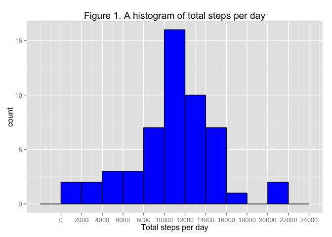
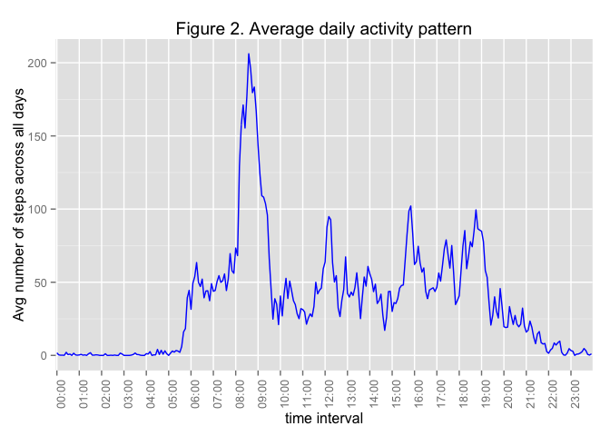
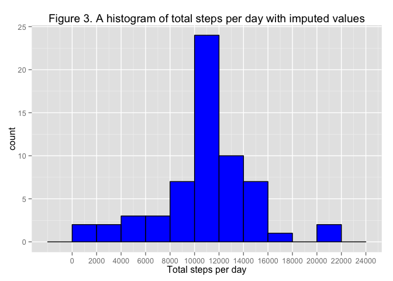
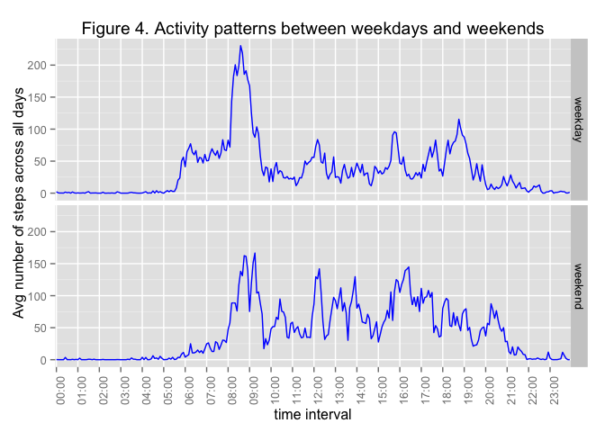

# Reproducible Research: Peer Assessment 1
Anya Chaliotis  


## Loading and preprocessing the data
Load data from CSV file and preview it.

```r
activity <- read.csv("activity.csv", header = T)
str(activity)
```

```
## 'data.frame':	17568 obs. of  3 variables:
##  $ steps   : int  NA NA NA NA NA NA NA NA NA NA ...
##  $ date    : Factor w/ 61 levels "2012-10-01","2012-10-02",..: 1 1 1 1 1 1 1 1 1 1 ...
##  $ interval: int  0 5 10 15 20 25 30 35 40 45 ...
```
Reformat raw data: 

```r
#configure data types
activity$date<-as.Date(activity$date,format="%Y-%m-%d") #convert dates to date
activity$interval<-as.factor(activity$interval) #288 intervals per day, from "00:00" to "23:55"
str(activity)
```

```
## 'data.frame':	17568 obs. of  3 variables:
##  $ steps   : int  NA NA NA NA NA NA NA NA NA NA ...
##  $ date    : Date, format: "2012-10-01" "2012-10-01" ...
##  $ interval: Factor w/ 288 levels "0","5","10","15",..: 1 2 3 4 5 6 7 8 9 10 ...
```

## What is mean total number of steps taken per day?
Create a tidy dataset that summarizes activity per day (exclude NAs)

```r
#activity dataset with no NAs
activity.complete.logical<-complete.cases(activity)
activity.complete<-activity[activity.complete.logical,]
#tidy dataset 1. activity dataset, summarize data per day, exclude NAs 
activity.per.day<-ddply(activity.complete,.(date),summarize,steps.total=sum(steps))
```
1.  Make a histogram of the total number of steps taken each day

```r
#ggplot histogram - changed bin size for more granularity
d<-ggplot(data=activity.per.day,aes(x=steps.total))  #data + mapping
d + geom_histogram(binwidth=2000, color="black", fill="blue") + 
    ggtitle("Figure 1. A histogram of total steps per day") +
    xlab("Total steps per day") +
    scale_x_continuous(breaks=seq(0, 25000, 2000))
```

 

2.  Calculate and report the mean and median total number of steps taken per day

```r
total.steps.per.day.mean<- format(mean(activity.per.day$steps.total),digits = 7)
total.steps.per.day.median<- median(activity.per.day$steps.total)
```
Mean total number of steps taken per day = 10766.19  
Median total number of steps taken per day = 10765

## What is the average daily activity pattern?
Create a tidy dataset that summarizes activity per interval (exclude NAs)

```r
#tidy dataset 2. activity dataset, summarize data per interval, exclued NAs
activity.per.interval<-ddply(activity.complete,.(interval),summarize, steps.mean=mean(steps))
```
1.  Make a time series plot (i.e. type = "l") of the 5-minute interval (x-axis) and the average number of steps taken, averaged across all days (y-axis)

```r
#ggplot line plot 
d<-ggplot(data=activity.per.interval,aes(x=interval,y=steps.mean,group=1))  #data + mapping
#custom ticks
x.axis.breaks<-seq(0,2300,by=100)
x.axis.breaks<-as.factor(x.axis.breaks)
x.axis.labels<-str_pad(x.axis.breaks,4, pad="0")
x.axis.labels<-paste0(substr(x.axis.labels,1,2),":",substr(x.axis.labels,3,4))

d + geom_line(col="blue") + 
    ggtitle("Figure 2. Average daily activity pattern") +
    xlab("time interval") + ylab("Avg number of steps across all days") +
    scale_x_discrete(breaks=x.axis.breaks, labels=x.axis.labels) +
    theme(axis.text.x = element_text(angle = 90, hjust = 1))
```

 

```r
#calculate 5-minute interval with max number of steps    
max.activity.per.interval<-activity.per.interval[activity.per.interval$steps == max(activity.per.interval$steps),]
```
2.  Which 5-minute interval, on average across all the days in the dataset, contains the maximum number of steps?   
Time interval at 8:35 shows the highest number of 206.17 steps, on average across all the days in the dataset.

## Imputing missing values
There are a number of days/intervals where there are missing values.  The presence of missing days may introduce bias into some calculations or summaries of the data.


```r
summary(activity) # summary function shows that colulmn "steps" has 2304 NAs
```

```
##      steps             date               interval    
##  Min.   :  0.00   Min.   :2012-10-01   0      :   61  
##  1st Qu.:  0.00   1st Qu.:2012-10-16   5      :   61  
##  Median :  0.00   Median :2012-10-31   10     :   61  
##  Mean   : 37.38   Mean   :2012-10-31   15     :   61  
##  3rd Qu.: 12.00   3rd Qu.:2012-11-15   20     :   61  
##  Max.   :806.00   Max.   :2012-11-30   25     :   61  
##  NA's   :2304                          (Other):17202
```

```r
activity.total.missing.values <- sum(is.na(activity$steps))
```
1. Total number of rows with missing values in the dataset  =  2304  
2. Impute the missing values in the dataset - use the mean for that 5-minute interval  
3. Create a new dataset that is equal to the original dataset but with the missing data filled in.

```r
activity.imputed<-activity
#find all rows with NAs
activity.imputed.NAs<-activity.imputed[is.na(activity.imputed$steps),]
#fill rows with missing data with the mean of the same time interval
activity.imputed[is.na(activity.imputed$steps),]$steps<-activity.per.interval$steps.mean
summary(activity.imputed) #no more NAs
```

```
##      steps             date               interval    
##  Min.   :  0.00   Min.   :2012-10-01   0      :   61  
##  1st Qu.:  0.00   1st Qu.:2012-10-16   5      :   61  
##  Median :  0.00   Median :2012-10-31   10     :   61  
##  Mean   : 37.38   Mean   :2012-10-31   15     :   61  
##  3rd Qu.: 27.00   3rd Qu.:2012-11-15   20     :   61  
##  Max.   :806.00   Max.   :2012-11-30   25     :   61  
##                                        (Other):17202
```
4a.  Make a histogram of the total number of steps taken each day 

```r
#tidy dataset 3. activity dataset, summarize data per day, imputed values instead of  NAs 
activity.imputed.per.day<-ddply(activity.imputed,.(date),summarize,steps.total=sum(steps))

#ggplot histogram - changed bin size for more granularity
d<-ggplot(data=activity.imputed.per.day,aes(x=steps.total))  #data + mapping
d + geom_histogram(binwidth=2000, color="black", fill="blue") + 
    ggtitle("Figure 3. A histogram of total steps per day with imputed values") +
    xlab("Total steps per day") +
    scale_x_continuous(breaks=seq(0, 25000, 2000))
```

 

4b.  Calculate and report the mean and median total number of steps taken per day. Do these values differ from the estimates from the first part of the assignment? What is the impact of imputing missing data on the estimates of the total daily number of steps?

```r
total.steps.imputed.per.day.mean<- format(mean(activity.imputed.per.day$steps.total),digits = 7)
total.steps.imputed.per.day.median<- format(median(activity.imputed.per.day$steps.total),digits = 7)
```
Mean total number of steps taken per day (with imputed values) = 10766.19  
Median total number of steps taken per day  (with imputed values) = 10766.19  
Analysis: by filling in missing values, the mean stayed the same, while the median value went up sligltly by less than 2 steps.  Imputed values, if chosen to fairly represent missing data, may fill the gaps for datapoints that were not collected during the data collection process (i.e. hardware malfunction, improper settings, etc.) 

## Are there differences in activity patterns between weekdays and weekends?
Use the dataset with the filled-in missing values for this part.  

1.  Create a new factor variable in the dataset with two levels -- "weekday" and "weekend" indicating whether a given date is a weekday or weekend day.


```r
activity.with.weekdays<-activity.imputed
#add day of the week and weekday/weekend factor
activity.with.weekdays$dayofweek<-as.factor(weekdays(activity.with.weekdays[,2]))
activity.with.weekdays[activity.with.weekdays$dayofweek=="Sunday" | activity.with.weekdays$dayofweek=="Saturday", "daytype"] <-"weekend"
activity.with.weekdays[!(activity.with.weekdays$dayofweek=="Sunday" | activity.with.weekdays$dayofweek=="Saturday"), "daytype"] <-"weekday"

##tidy dataset 4. activity dataset, summarize data per interval, imputed values instead of NAs 
activity.imputed.per.interval<-ddply(activity.with.weekdays,.(interval, daytype),summarize,steps.mean=mean(steps))
activity.imputed.per.interval$daytype<-as.factor(activity.imputed.per.interval$daytype)
```

2.  Make a panel plot containing a time series plot of the 5-minute interval (x-axis) and the average number of steps taken, averaged across all weekday days or weekend days (y-axis).


```r
#ggplot line plot 
g<-ggplot(data=activity.imputed.per.interval, aes(x=interval,y=steps.mean,group=daytype))+ 
    ggtitle("Figure 4. Activity patterns between weekdays and weekends") +
    xlab("time interval") + ylab("Avg number of steps across all days") +
    scale_x_discrete(breaks=x.axis.breaks, labels=x.axis.labels) +
    theme(axis.text.x = element_text(angle = 90, hjust = 1))
g+geom_line(col="blue") + facet_grid(daytype~.)
```

 

